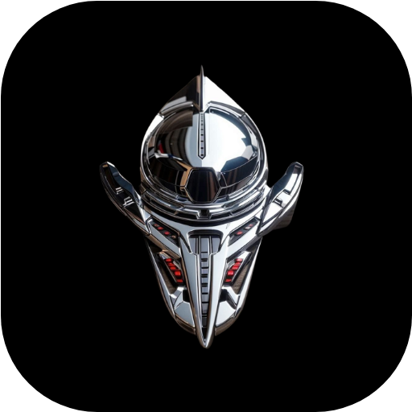

# Sakhir App

Decentralized media for F1 racing.

 

 

> The app still development. and so feel free to use the available and ready features. At the moment of reading this, please fill any requests, issues you had...

## Get Started

Sakhir is a F1 racing social app where you can share & discover content related to F1 competition, teams, cars, etc. Connect with your friends around the world, get to know their toughts, and share yours as well in a <b>decentralized</b> way.

Nostr is an open protocol that enables a truly censorship-resistant and global social network, Sakhir upgrades its capabilities with cryptographic keys to help purify intentions online, it make use of Nostr in order to provide a decentralized social network where you own everything you share, and no one can manipulate you, your thoughts and your data.

## Download

Before you begin, please notice that the app is available currently on Android only, you will need an Android phone at least an Android version (5.0.0+).

#### Direct download
You can start using the Sakhir app by downloading it from [the download page here](https://github.com/Sakhir-Projects/sakhir-app/releases/tag/v1).

#### Qr Code

You can also scan this QR code to open the download page automatically.

 

